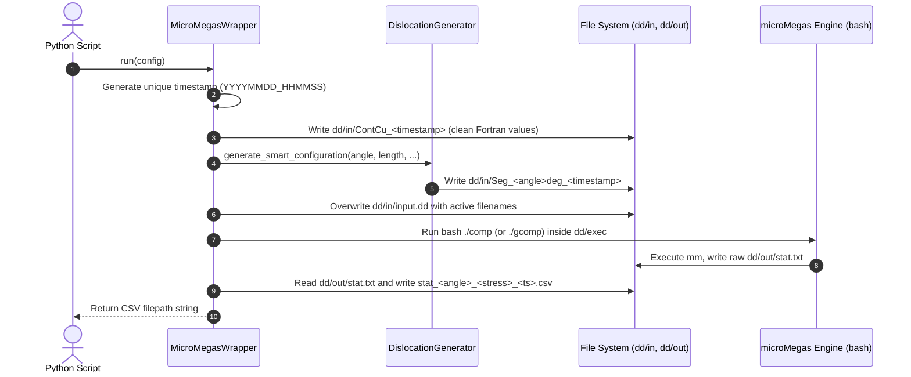

# microMegas Python Wrapper (`micromegas_wrapper.py`)

A high-level, automated Python interface for configuring, running, and analyzing **Discrete Dislocation Dynamics (DDD)** simulations using the open-source **microMegas (mM)** engine.

---

## Table of Contents

1. [Overview](#1-overview)
2. [Prerequisites & Environment Setup](#2-prerequisites--environment-setup)
3. [Architecture Overview](#3-architecture-overview)
4. [Quick Start (Minimal Example)](#4-quick-start-minimal-example)
5. [Comprehensive Sample Script](#5-comprehensive-sample-script)
6. [What Happens Under the Hood](#6-what-happens-under-the-hood)
7. [Parameter Reference Guide](#7-parameter-reference-guide)
   - [Simulation Configuration (`SimulationConfig`)](#simulation-configuration-simulationconfig)
   - [Physics & Control Parameters (`ContCuConfig`)](#physics--control-parameters-contcuconfig)
8. [Dislocation Geometry & The Smart Staircase Generator](#8-dislocation-geometry--the-smart-staircase-generator)
9. [Understanding the Output Data (`stat.txt` / CSV)](#9-understanding-the-output-data-stattxt--csv)
10. [Troubleshooting & FAQs](#10-troubleshooting--faqs)

---

## 1. Overview

**microMegas (mM)** is a specialized 2.5D/3D Discrete Dislocation Dynamics (DDD) simulation code written in Fortran. It simulates how dislocation line defects move, bow out, interact, multiply (e.g., Frank-Read sources), and form junctions in crystalline metals like FCC Copper (Cu).

### Why use `micromegas_wrapper.py`?
Traditionally, running a microMegas simulation required:
- Manually editing whitespace-sensitive, strictly-formatted Fortran parameter files (`ContCu`, `Cu`, `input.dd`).
- Hand-calculating 3D crystallographic step vectors and connectivity tables for dislocation lines (`SegCu`).
- Navigating to internal directories (`dd/exec`) and running shell scripts (`./comp` or `./gcomp`).
- Manually parsing column-delimited raw text output files (`dd/out/stat.txt`).

`micromegas_wrapper.py` automates this entire pipeline:
- **Object-Oriented Configuration**: Set physical parameters and simulation settings directly via Python dataclasses.
- **Smart Dislocation Generator**: Automatically constructs pinned Frank-Read dislocation lines at any arbitrary character angle $\beta$ (0° screw, 90° edge, or any intermediate angle like 30° or 45°) using discrete FCC crystallographic steps.
- **Automated Lifecycle Management**: Writes clean input files with collision-free timestamps, triggers the Fortran build and execution engine, and suppresses noisy compiler output.
- **Instant CSV Export**: Converts microMegas space-separated statistics (`stat.txt`) into ready-to-analyze CSV files for use with `pandas`, `numpy`, and `matplotlib`.

---

## 2. Prerequisites & Environment Setup

Before using the wrapper, ensure your system has the required dependencies:

### 1. Python Environment
- **Python 3.8+**
- Required standard libraries: `os`, `csv`, `subprocess`, `datetime`, `pathlib`, `dataclasses`, `typing`
- Required scientific libraries:
  ```bash
  pip install numpy pandas matplotlib
  ```

### 2. microMegas Build Tools
Because microMegas compiles and runs native Fortran code, your execution environment must have access to:
- **`bash`** (shell)
- **`make`** (build automation)
- **`gfortran`** (GNU Fortran compiler)

> **Platform Notes**:
> - **Linux / macOS**: `bash`, `make`, and `gfortran` are typically available via standard package managers (`apt install build-essential gfortran` or `brew install gcc make`).
> - **Windows**: microMegas requires a POSIX shell environment. Run Python from within **WSL (Windows Subsystem for Linux)**, **Git Bash**, or **MSYS2/MinGW64** where `bash`, `make`, and `gfortran` are installed in your `PATH`.

---

## 3. Architecture Overview

`micromegas_wrapper.py` is divided into four main components:

```
+-------------------------------------------------------------------------+
|                           SimulationConfig                              |
|  (Dislocation length, angle, box bounds, coordinates, graphics flag)    |
|                                                                         |
|  +-------------------------------------------------------------------+  |
|  |                          ContCuConfig                             |  |
|  |  (Stress mode, initial stress, time step, cross-slip, line tension)|  |
|  +-------------------------------------------------------------------+  |
+-------------------------------------------------------------------------+
                                    |
                                    v
+-------------------------------------------------------------------------+
|                        DislocationGenerator                             |
|  - Native orientations: 0° (screw), 60° (mixed), 90° (edge)             |
|  - Smart Staircase algorithm: arbitrary intermediate angles             |
|  - Pinned endpoints for Frank-Read sources (connectivity = 0)           |
+-------------------------------------------------------------------------+
                                    |
                                    v
+-------------------------------------------------------------------------+
|                         MicroMegasWrapper                               |
|  1. Writes dd/in/ContCu_<timestamp>                                    |
|  2. Writes dd/in/Seg_<angle>deg_<timestamp>                             |
|  3. Updates dd/in/input.dd pointer table                                |
|  4. Calls dd/exec/comp or dd/exec/gcomp via subprocess                  |
|  5. Parses dd/out/stat.txt -> dd/out/stat_<angle>_<stress>_<ts>.csv     |
+-------------------------------------------------------------------------+
```

---

## 4. Quick Start (Minimal Example)

Here is a minimal script to run a single simulation with default settings:

```python
from pathlib import Path
from micromegas_wrapper import MicroMegasWrapper, SimulationConfig

# 1. Point to your repository root (where the 'dd' directory lives)
REPO_ROOT = Path(".").resolve()
wrapper = MicroMegasWrapper(base_repo_path=str(REPO_ROOT))

# 2. Define the simulation configuration
config = SimulationConfig(
    target_length_nm=100.0,   # Dislocation segment length: 100 nm
    angle_deg=0,              # Pure screw dislocation (0 degrees)
    box_dim_x=2464,           # Simulation cell size in X
    box_dim_y=2464,           # Simulation cell size in Y
    box_dim_z=2464,           # Simulation cell size in Z
)

# 3. Adjust initial resolved shear stress (in MPa)
config.cont_cu.sigma0 = 60.0

# 4. Run the simulation
print("Starting simulation...")
csv_output_path = wrapper.run(config)
print(f"Simulation completed! CSV results saved to: {csv_output_path}")
```

---

## 5. Comprehensive Sample Script

Below is a complete, production-ready script demonstrating:
1. Importing the wrapper and dataclasses.
2. Customizing geometry, physics, and solver parameters.
3. Conducting parameter sweeps (e.g., across dislocation angles $\beta$ and stresses $\sigma_0$).
4. Loading and plotting the generated CSV results using `pandas` and `matplotlib`.

```python
"""
run_simulation_study.py
-----------------------
Comprehensive example demonstrating how to configure, execute, and analyze
microMegas simulations using micromegas_wrapper.py.
"""

from pathlib import Path
import pandas as pd
import matplotlib.pyplot as plt
from micromegas_wrapper import MicroMegasWrapper, SimulationConfig, ContCuConfig

# =============================================================================
# 1. INITIALIZE THE WRAPPER
# =============================================================================
# Set the path to the root directory where the 'dd/' directory is located
REPO_ROOT = Path(__file__).resolve().parent
wrapper = MicroMegasWrapper(base_repo_path=str(REPO_ROOT))

# =============================================================================
# 2. DEFINE SIMULATION PARAMETERS
# =============================================================================
# Test across multiple dislocation character angles (degrees):
# 0° = Pure Screw, 60° = Mixed, 90° = Pure Edge, 30°/45° = Staircase mixed
ANGLES_TO_TEST = [0, 60, 90]

# Dislocation line length in nanometers (typical Frank-Read source length)
DISLOCATION_LENGTH_NM = 100.0

# Simulation box dimensions (in microMegas lattice units)
BOX_DIMENSIONS = (2464, 2464, 2464)
STARTING_COORDINATES = (1200, 1200, 1200)

# Dictionary to collect results for plotting
simulation_results = {}

# =============================================================================
# 3. RUN PARAMETER SWEEPS
# =============================================================================
for angle in ANGLES_TO_TEST:
    print(f"\n" + "="*60)
    print(f"Configuring Simulation: Angle = {angle}°, Length = {DISLOCATION_LENGTH_NM} nm")
    print("="*60)

    # A. Instantiate master configuration
    sim_config = SimulationConfig(
        target_length_nm=DISLOCATION_LENGTH_NM,
        angle_deg=angle,
        box_dim_x=BOX_DIMENSIONS[0],
        box_dim_y=BOX_DIMENSIONS[1],
        box_dim_z=BOX_DIMENSIONS[2],
        start_coord=STARTING_COORDINATES,
        material_name="Cu",        # References dd/in/Cu
        use_graphics=False         # False = headless (./comp); True = GUI (./gcomp)
    )

    # B. Customize microMegas Control Parameters (ContCuConfig)
    # ---------------------------------------------------------
    # Mode of deformation:
    # 0 = Strain rate imposed
    # 3 = Stress rate imposed (constant stress increment)
    # 4 = Constant stress
    sim_config.cont_cu.mode_deformation = 3

    # Initial applied stress in MPa
    sim_config.cont_cu.sigma0 = 55.0

    # Stress increment rate (MPa/s) formatted for Fortran double-precision
    sim_config.cont_cu.sigma_point = "5D10"

    # Elementary time step in seconds
    sim_config.cont_cu.deltat0 = "0.125D-11"

    # Total number of integration steps
    sim_config.cont_cu.nstep = 10000

    # Line tension formulation: 0=Friedel, 1=DeWit, 2=Foreman, 3=Tabulated
    sim_config.cont_cu.linten = 1

    # Cross-slip activation ('T' = True, 'F' = False)
    sim_config.cont_cu.gldev = 'T'

    # Temperature in Kelvin
    sim_config.cont_cu.temperature = 300.0

    # Relaxation steps before loading (helps settle initial line configuration)
    sim_config.cont_cu.relax_int = 100
    sim_config.cont_cu.relax_reac = 100

    # Statistics output frequency (records a row to stat.txt every N steps)
    sim_config.cont_cu.kstats = 200

    # C. Execute the simulation
    # -------------------------
    # The wrapper generates the input files, runs the engine, and parses the output
    csv_file_path = wrapper.run(sim_config)
    print(f"-> Successfully completed run for {angle}°.")
    print(f"-> Exported CSV: {csv_file_path}")

    # Store file path for analysis
    simulation_results[angle] = csv_file_path

# =============================================================================
# 4. POST-PROCESSING & PLOTTING RESULTS
# =============================================================================
print("\n" + "="*60)
print("Plotting Simulation Data...")
print("="*60)

plt.figure(figsize=(10, 6))

for angle, csv_path in simulation_results.items():
    # Read the generated CSV file
    df = pd.read_csv(csv_path)

    # Verify expected columns exist
    # 'EPS_PLA' = Plastic Strain, 'TAU_1' = Resolved Shear Stress (MPa)
    if 'EPS_PLA' in df.columns and 'TAU_1' in df.columns:
        plt.plot(df['TAU_1'], df['EPS_PLA'], marker='o', markersize=3, label=f"Angle {angle}°")
    else:
        # Fallback: plot first column vs second column if header differs
        plt.plot(df.iloc[:, 0], df.iloc[:, 1], label=f"Angle {angle}°")

plt.title(f"Plastic Strain vs. Shear Stress (Dislocation Length = {DISLOCATION_LENGTH_NM} nm)", fontsize=13)
plt.xlabel("Resolved Shear Stress (MPa)", fontsize=11)
plt.ylabel("Plastic Strain (EPS_PLA)", fontsize=11)
plt.grid(True, linestyle="--", alpha=0.6)
plt.legend()
plt.tight_layout()

output_plot_path = REPO_ROOT / "dd" / "out" / "stress_strain_comparison.png"
plt.savefig(output_plot_path, dpi=300)
print(f"Plot saved successfully to: {output_plot_path}")
plt.show()
```

---

## 6. What Happens Under the Hood

When you call `wrapper.run(config)`, the wrapper executes a deterministic 5-step lifecycle:



### Detailed Step Breakdown

1. **Timestamp Generation**:
   A timestamp `YYYYMMDD_HHMMSS` (e.g. `20260903_143022`) is created. This ensures your configuration files (`ContCu_*` and `Seg_*`) never overwrite previous simulation runs.

2. **Control File Generation (`dd/in/ContCu_<timestamp>`)**:
   Fortran's `READ` statements expect raw numerical values without text headers or trailing inline comments. The wrapper formats all 41 fields of `ContCuConfig` sequentially onto individual lines.

3. **Dislocation Geometry Generation (`dd/in/Seg_<angle>deg_<timestamp>`)**:
   The `DislocationGenerator` calculates the necessary segment lengths and unit vectors. For Frank-Read sources, it sets boundary neighbor connectivity flags to `0`, ensuring the endpoints are permanently pinned.

4. **Input Pointer Mapping (`dd/in/input.dd`)**:
   microMegas reads `dd/in/input.dd` at startup to locate which material, control, and segment files to load:
   ```text
   Cu
   ContCu_20260903_143022
   Seg_0deg_20260903_143022
   ```

5. **Engine Execution (`dd/exec/comp` or `dd/exec/gcomp`)**:
   The wrapper invokes `subprocess.run(["bash", "./comp"], cwd=dd/exec)`:
   - It runs `make mm` in `dd/bin` to compile the Fortran sources.
   - It launches `./mm` which executes the time-integration steps.
   - Compiler `stdout` is muted to avoid terminal flooding, while any fatal errors in `stderr` are trapped and displayed with clear error messages.

6. **Output Parsing (`dd/out/stat.txt` -> CSV)**:
   Once the engine finishes, microMegas writes whitespace-delimited tabular data to `dd/out/stat.txt`. The wrapper reads this file and exports a cleanly structured, timestamped CSV:
   `dd/out/stat_angle<angle>_stress<sigma0>_<timestamp>.csv`.

---

## 7. Parameter Reference Guide

### Simulation Configuration (`SimulationConfig`)

| Attribute | Type | Default | Description |
| :--- | :--- | :--- | :--- |
| `target_length_nm` | `float` | *(Required)* | Physical length of the dislocation segment in nanometers ($L$). |
| `angle_deg` | `int` | *(Required)* | Dislocation character angle $\beta$ in degrees ($0^\circ$ = screw, $90^\circ$ = edge). |
| `box_dim_x` | `int` | *(Required)* | Periodic simulation volume dimension along X (internal lattice units). |
| `box_dim_y` | `int` | *(Required)* | Periodic simulation volume dimension along Y (internal lattice units). |
| `box_dim_z` | `int` | *(Required)* | Periodic simulation volume dimension along Z (internal lattice units). |
| `start_coord` | `Tuple[int, int, int]` | `(1200, 1200, 1200)` | Initial $(X, Y, Z)$ coordinates placing the dislocation inside the box. |
| `material_name` | `str` | `"Cu"` | Name of the base material file present in `dd/in/` (e.g. `"Cu"`). |
| `use_graphics` | `bool` | `False` | `False`: headless batch mode (`./comp`); `True`: graphical X11 window (`./gcomp`). |
| `cont_cu` | `ContCuConfig` | `ContCuConfig()` | Nested dataclass instance containing all microMegas control parameters. |

---

### Physics & Control Parameters (`ContCuConfig`)

All fields within `ContCuConfig` can be customized directly on `config.cont_cu.<parameter>`.

#### 1. Deformation & Loading Modes
| Parameter | Type | Default | Explanation |
| :--- | :--- | :--- | :--- |
| `mode_deformation` | `int` | `3` | Loading mode:<br>• `0`: Imposed strain rate ($\dot{\varepsilon}$)<br>• `3`: Imposed stress rate ($\dot{\sigma}$)<br>• `4`: Constant stress ($\sigma = \text{const}$)<br>• `5`: Cyclic fatigue<br>• `9`: Creep |
| `sigma0` | `float` | `95.0` | Initial applied stress in MPa. |
| `sigma_point` | `str` | `'5D10'` | Stress rate increment $\dot{\sigma}$ in MPa/s (Fortran double precision string format). |
| `epsilon_point` | `float` | `0.0` | Imposed strain rate $\dot{\varepsilon}$ ($s^{-1}$) when `mode_deformation = 0`. |
| `shear` | `str` | `'T'` | `'T'`: Shear stress resolved on highest Schmid factor slip system.<br>`'F'`: Uniaxial tensile/compressive stress. |
| `tensile_axis` | `str` | `'0 0 1'` | Miller indices of loading direction (e.g. `'0 0 1'` or `'1 1 0'`). |

#### 2. Time & Space Discretization
| Parameter | Type | Default | Explanation |
| :--- | :--- | :--- | :--- |
| `deltat0` | `str` | `'0.125D-11'` | Elementary simulation time step in seconds ($\Delta t$). |
| `nstep` | `int` | `10000` | Total number of simulation integration steps. |
| `echelle` | `float` | `13.5` | Discretization reference scale (size of elementary screw vectors in Burgers units). |
| `facteur_depmax` | `int` | `100` | Maximum segment displacement permitted in a single time step ($b$). |
| `ldis_act` | `float` | `0.25` | Maximum segment length ($\mu m$) before dynamic re-discretization is triggered. |

#### 3. Physical Mechanisms
| Parameter | Type | Default | Explanation |
| :--- | :--- | :--- | :--- |
| `temperature` | `float` | `300.0` | Temperature in Kelvin (affects thermal activation and dislocation mobility). |
| `gldev` | `str` | `'T'` | Cross-slip activation flag (`'T'` = active, `'F'` = inactive). |
| `linten` | `int` | `1` | Line tension calculation model:<br>• `0`: Friedel<br>• `1`: DeWit (standard)<br>• `2`: Foreman<br>• `3`: Tabulated anisotropic (from `disdi`) |
| `key_nucleation` | `str` | `'F'` | Homogeneous dislocation nucleation (`'T'`/`'F'`). |
| `key_crack` | `str` | `'F'` | Superimpose stress field of a sharp crack (`'T'`/`'F'`). |

#### 4. Relaxation & Solver Control
| Parameter | Type | Default | Explanation |
| :--- | :--- | :--- | :--- |
| `relax_int` | `int` | `100` | Relaxation steps under zero applied load and without contact reactions. |
| `relax_reac` | `int` | `100` | Relaxation steps under zero applied load with contact reactions enabled. |
| `kstats` | `int` | `200` | Periodicity of output logging (appends to `stat.txt` every $N$ steps). |
| `kisauve` | `int` | `1000` | State backup write periodicity (used for simulation restart). |

---

## 8. Dislocation Geometry & The Smart Staircase Generator

In discrete dislocation dynamics on an FCC lattice, dislocations are constrained to discrete crystallographic directions on $\{111\}$ slip planes.

```
       [Edge Step] (idx: 7, dx: -2, dy: 4, dz: -2)
            ^
            |
            |___> [Screw Step] (idx: 1, dx: -2, dy: 0, dz: 2)
```

The `DislocationGenerator` handles two geometric regimes:

### 1. Native Crystallographic Angles ($0^\circ, 60^\circ, 90^\circ$)
For pure screw ($0^\circ$), mixed ($60^\circ$), and pure edge ($90^\circ$), microMegas natively represents the line as a single discrete segment:
$$\text{Units} = \text{round}\left(\frac{L_{\text{target}}}{l_{\text{unit}}}\right)$$
where $l_{\text{screw}} \approx 3.4459\text{ nm}$ and $l_{\text{edge}} \approx 5.9684\text{ nm}$.

### 2. Arbitrary Intermediate Angles (Smart Staircase Generator)
For angles such as $15^\circ, 30^\circ, 45^\circ$, or $75^\circ$, a single vector cannot represent the line. The generator calculates:
$$N_{\text{edge}} = \text{round}\left(\frac{L \sin \beta}{l_{\text{edge}}}\right), \quad N_{\text{screw}} = \text{round}\left(\frac{L \cos \beta}{l_{\text{screw}}}\right)$$
It then:
1. Distributes Edge and Screw segments smoothly using a Bresenham digital line sequence.
2. Groups consecutive segments of the same character into multi-unit blocks.
3. Automatically sets connectivity:
   - Inner segments are linked with relative neighbor indices (`-1`).
   - Boundary segments are set to `0` to keep the endpoints **pinned** as a Frank-Read source.

---

## 9. Understanding the Output Data (`stat.txt` / CSV)

Each completed simulation exports a CSV file named:
`dd/out/stat_angle<angle>_stress<sigma0>_<timestamp>.csv`

### Column Descriptions

| Column Header | Physical Meaning | Units |
| :--- | :--- | :--- |
| `EPS_PLA` | Total accumulated plastic strain | Dimensionless |
| `JONC` | Total number of junction segments formed | Count |
| `GD` | Number of cross-slip events / segments | Count |
| `LL` | Total number of active dislocation line segments | Count |
| `SWEEP_S` | Area swept by pure screw segments | $\text{nm}^2$ |
| `SWEEP_E` | Area swept by pure edge segments | $\text{nm}^2$ |
| `SWEEP_M` | Area swept by mixed segments | $\text{nm}^2$ |
| `RHO_1` | Dislocation density obeying velocity law #1 | $\text{m}^{-2}$ |
| `RHO_2` | Dislocation density obeying velocity law #2 | $\text{m}^{-2}$ |
| `LENGTH_1` | Total length of dislocation lines in group 1 | Internal units |
| `TAU_1` | Resolved shear stress on primary slip system | $\text{MPa}$ |
| `TAU_2` | Resolved shear stress on secondary slip system | $\text{MPa}$ |
| `DensLoop` | Dislocation density contributed by prismatic/shear loops | $\text{m}^{-2}$ |
| `DensInf` | Dislocation density of infinite (PBC) lines | $\text{m}^{-2}$ |

### Quick Analysis with Pandas
```python
import pandas as pd

df = pd.read_csv("dd/out/stat_angle0_stress60.0_20260903_143022.csv")

# Print peak plastic strain and maximum stress
print("Max Stress:", df['TAU_1'].max(), "MPa")
print("Total Plastic Strain:", df['EPS_PLA'].iloc[-1])
print("Dislocation Line Count at End:", df['LL'].iloc[-1])
```

---

## 10. Troubleshooting & FAQs

### Q1: `FileNotFoundError: stat.txt was not found`
- **Cause**: microMegas failed to compile or crashed before writing output.
- **Solution**:
  1. Ensure `gfortran` and `make` are installed and reachable in your terminal (`gfortran --version`).
  2. Test compilation manually:
     ```bash
     cd dd/exec
     bash ./comp
     ```
  3. Check `dd/out/` for error logs or core dump files.

### Q2: `subprocess.CalledProcessError` on Windows
- **Cause**: Windows cannot locate `bash` natively from standard Command Prompt or PowerShell.
- **Solution**:
  - Run the Python script inside **WSL (Ubuntu)** or a **Git Bash** terminal.
  - Ensure `bash.exe` (from Git or WSL) is present in your Windows System `PATH`.

### Q3: Dislocation segment leaves the simulation volume
- **Cause**: The dislocation bowed out beyond the boundaries of the periodic box.
- **Solution**:
  - Increase `box_dim_x`, `box_dim_y`, and `box_dim_z` in `SimulationConfig` (e.g. from `2464` to `4928`).
  - Center the starting point using `start_coord=(box_dim_x // 2, box_dim_y // 2, box_dim_z // 2)`.

### Q4: The dislocation does not bow out or multiply
- **Cause**: Applied shear stress $\sigma_0$ is lower than the critical Frank-Read bow-out stress $\tau_{\text{crit}}$.
- **Solution**:
  - According to Frank-Read theory:
    $$\tau_{\text{crit}} \approx \alpha \frac{\mu b}{L}$$
  - For Copper ($\mu \approx 42\text{ GPa}, b \approx 0.255\text{ nm}, L \approx 100\text{ nm}$), $\tau_{\text{crit}} \approx 50 - 65\text{ MPa}$.
  - Increase `config.cont_cu.sigma0` above the critical stress.
